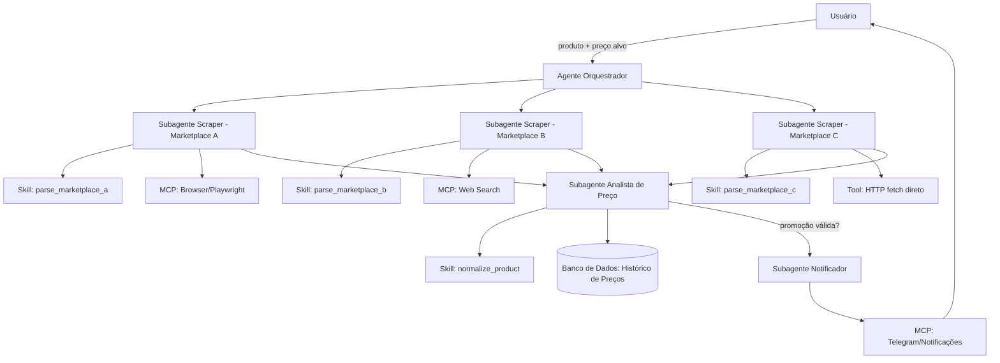
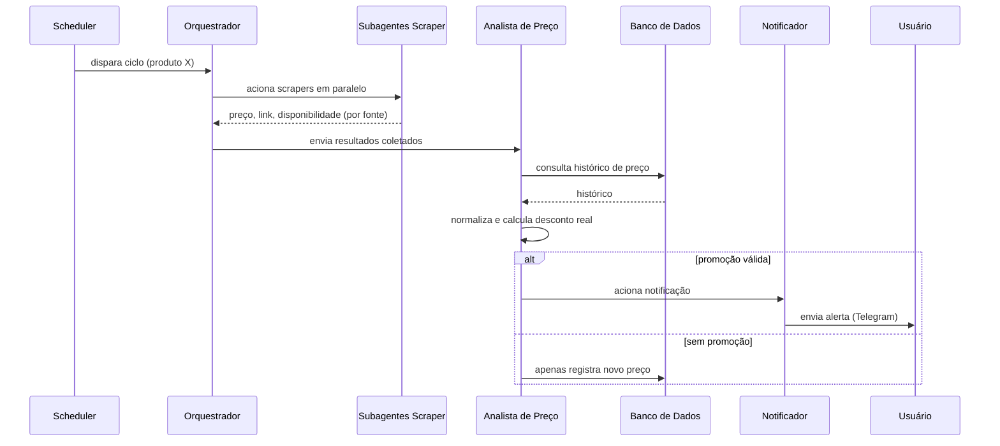

# PromoRadar 🛰️


Agente autônomo e modular para monitoramento contínuo de preços de produtos na web, detecção de promoções reais com base em histórico persistido e alertas automáticos via Telegram.

Acompanhar promoções manualmente exige visitar dezenas de e-commerces várias vezes ao dia, com alto risco de perder promoções relâmpago ou cair em falsos descontos ("metade do dobro"). O **PromoRadar** resolve esse atrito automatizando a varredura concorrente em múltiplos marketplaces, isolando falhas por subagente e alertando o usuário apenas quando o preço atinge o alvo configurado ou uma mínima histórica real.

---

## 📑 Sumário

- [Funcionalidades Principais](#-funcionalidades-principais)
- [Arquitetura](#-arquitetura)
- [Stack Tecnológica](#-stack-tecnológica)
- [Pré-requisitos](#-pré-requisitos)
- [Instalação](#-instalação)
- [Configuração](#-configuração)
- [Como Usar](#-como-usar)
- [Exemplo de Notificação](#-exemplo-de-notificação)
- [Estrutura de Pastas](#-estrutura-de-pastas)
- [Como Adicionar um Novo Marketplace](#-como-adicionar-um-novo-marketplace)
- [Roadmap](#-roadmap)
- [Aviso Legal](#-aviso-legal)
- [Licença](#-licença)
- [Como Contribuir](#-como-contribuir)

---

## ✨ Funcionalidades Principais

- **Monitoramento Concorrente:** Coleta assíncrona paralela em múltiplos marketplaces via subagentes.
- **Isolamento Total de Falhas:** A queda, bloqueio ou alteração de layout em uma loja não interrompe a coleta nas demais.
- **Detecção de Falsos Descontos:** Heurística que confronta o preço "de" anunciado contra o histórico real persistido.
- **Seleção Dinâmica por Produto:** Possibilidade de escolher onde compensa buscar para cada item monitorado.
- **Meta-Agregador Google Shopping:** Captura de ofertas em tempo real consolidadas no carrossel de Sponsored Products.
- **Alertas Ricos via Telegram:** Notificações instantâneas com badge de oportunidade, justificativa e link direto.
- **Persistência Leve em SQLite:** Histórico completo de preços e alertas com suporte a modo WAL.

---

## 🏛️ Arquitetura

O sistema adota uma arquitetura orientada a agentes especialistas: um **Agente Orquestrador** coordena **Subagentes** (Scrapers, Analista de Preço e Notificador), que por sua vez utilizam **Skills** procedurais e **Tools/MCPs**:

### Diagrama de Componentes



### Fluxo de Execução do Ciclo



---

## 🧰 Stack Tecnológica

| Camada | Tecnologia | Justificativa / Uso |
|---|---|---|
| **Linguagem** | Python 3.10+ (compatível com 3.14) | Produtividade, ecossistema assíncrono e tipagem moderna |
| **Orquestração** | Python Nativo (`asyncio` / subagentes) | Desacoplamento entre coleta, regras de negócio e notificação |
| **Scraping Estático** | `httpx` + `BeautifulSoup4` | Requisições assíncronas com backoff, rate limit e parsing rápido de HTML |
| **Navegação Dinâmica** | Playwright (planejado / sob demanda) | Renderização para marketplaces que dependem estritamente de JS pesado |
| **Validação de Dados** | `pydantic` v2 + `pydantic-settings` | Schemas estritos de domínio e validação de variáveis de ambiente |
| **Banco de Dados** | SQLite (modo WAL) | Persistência local com zero dependência externa no MVP |
| **Agendamento** | `APScheduler` | Daemon assíncrono para ciclos periódicos configuráveis |
| **Notificações** | Telegram Bot API | Disparo push imediato via HTTP com fallback para console |
| **Logs & Testes** | `loguru`, `pytest`, `pytest-asyncio` | Logs estruturados e suíte de testes unitários com fixtures locais |
| **Qualidade de Código** | `ruff` | Linting e formatação de alta velocidade |

---

## ⚙️ Pré-requisitos

- **Python:** Versão 3.10 ou superior instalada no sistema.
- **Git:** Para clonagem e versionamento.
- **Credenciais do Telegram (Opcional):** Token do bot (`TELEGRAM_BOT_TOKEN`) e ID do chat (`TELEGRAM_CHAT_ID`). Se ausentes, o sistema exibe os alertas diretamente no terminal.

---

## 📦 Instalação

Siga os passos abaixo para configurar o ambiente local:

```bash
# 1. Clonar o repositório
git clone https://github.com/hlaff147/price-scout-agent.git
cd price-scout-agent

# 2. Criar e ativar o ambiente virtual (venv)
python3 -m venv .venv
source .venv/bin/activate

# 3. Instalar dependências em modo editável com ferramentas de dev
pip install -e ".[dev]"

# 4. Configurar as variáveis de ambiente
cp .env.example .env
```

Edite o arquivo `.env` para preencher as credenciais (Telegram, nível de log, etc.):

```env
TELEGRAM_BOT_TOKEN=seu_token_aqui
TELEGRAM_CHAT_ID=seu_chat_id_aqui
DATABASE_PATH=data/promoradar.db
LOG_LEVEL=INFO
CHECK_INTERVAL_HOURS=1
DRY_RUN=false
```

---

## 🛠️ Configuração

Os produtos monitorados são configurados no arquivo [`src/config/products.yaml`](file:///Users/humbertolimadealcantarafonsecafilho/price-scout-agent/src/config/products.yaml). Você pode definir nome, palavras-chave, limites de preço e habilitar (`ativo: true`) apenas as lojas onde compensa buscar:

```yaml
products:
  - id: "huawei-freebuds-pro-5"
    nome: "Huawei FreeBuds Pro 5"
    keywords:
      - "Huawei FreeBuds Pro 5"
      - "FreeBuds Pro 5"
      - "Huawei FreeBuds Pro"
    preco_alvo: 850.00
    preco_maximo: 1100.00
    ativo: true
    sources:
      # Fontes ativas recomendadas para este fone:
      - marketplace: "amazon"
        url_produto: "https://www.amazon.com.br/s?k=Huawei+FreeBuds+Pro+5"
        metodo_coleta: "scraping_html"
        ativo: true

      - marketplace: "mercadolivre"
        url_produto: "https://lista.mercadolivre.com.br/huawei-freebuds-pro-5"
        metodo_coleta: "scraping_html"
        ativo: true

      - marketplace: "shopee"
        url_produto: "https://shopee.com.br/search?keyword=Huawei%20FreeBuds%20Pro%205"
        metodo_coleta: "scraping_html"
        ativo: true

      - marketplace: "google_shopping"
        url_produto: "https://www.google.com/search?q=huawei+Freebuds+Pro+5&udm=28"
        metodo_coleta: "scraping_html"
        ativo: true

      # Fontes desativadas especificamente onde não compensa buscar este item:
      - marketplace: "kabum"
        url_produto: "https://www.kabum.com.br/busca/huawei-freebuds-pro-5"
        ativo: false
        motivo_desativacao: "preco_muito_caro"

      - marketplace: "aliexpress"
        url_produto: "https://pt.aliexpress.com/w/wholesale-huawei-freebuds-pro-5.html"
        ativo: false
        motivo_desativacao: "imposto_importacao_elevado"
```

---

## 🚀 Como Usar

### 1. Execução Sob Demanda (Ciclo Único)

```bash
# Execução normal (envia notificações se houver oferta)
python scripts/run_cycle.py

# Simulação sem envio de alertas reais (Dry-Run)
python scripts/run_cycle.py --dry-run

# Execução com logs detalhados de depuração
python scripts/run_cycle.py --dry-run -v

# Filtrando por um produto específico
python scripts/run_cycle.py --product huawei-freebuds-pro-5
```

### 2. Execução Agendada Contínua (Daemon)

```bash
# Inicia o agendador em segundo plano (intervalo padrão: 1 hora)
python scripts/schedule_daemon.py

# Definindo intervalo customizado (ex: a cada 2 horas)
python scripts/schedule_daemon.py --interval-hours 2
```

### 3. Atalhos via Makefile

```bash
make run       # Executa o ciclo sob demanda
make dry-run   # Executa em modo simulação com logs verbose
make test      # Executa a suíte completa de 17 testes automatizados
make daemon    # Inicia o daemon agendado
```

---

## 📬 Exemplo de Notificação

Quando o agente detecta uma oferta real que cumpre as condições de compra, a notificação chega formatada no Telegram:

```text
🎯 PREÇO ABAIXO DO ALVO DEFINIDO!

📦 Produto: Huawei FreeBuds Pro 5
🛒 Loja: AMAZON
💰 Preço Atual: R$ 721,64
📉 Mínima Anterior: R$ 899,00
🏷️ Desconto Real: 19.7% (vs. histórico)
🎟️ Cupom Disponível: PROMOFONE

💡 Preço de R$ 721,64 atingiu seu alvo de compra (R$ 850,00).

🔗 Ver Oferta na Loja (https://www.amazon.com.br/dp/B0...)
```

---

## 📂 Estrutura de Pastas

```
promo-radar/
├── src/
│   ├── orchestrator/        # Coordenação central do ciclo e execução paralela
│   ├── subagents/           # Subagentes isolados (scraper, analista, notificador)
│   │   ├── scraper_agent/
│   │   ├── price_analyst_agent/
│   │   └── notifier_agent/
│   ├── skills/              # SKILL.md + lógica de parsing por marketplace
│   │   ├── parse_amazon/
│   │   ├── parse_mercadolivre/
│   │   ├── parse_shopee/
│   │   ├── parse_aliexpress/
│   │   ├── parse_kabum/
│   │   ├── parse_google_shopping/
│   │   ├── normalize_product/
│   │   ├── detect_fake_discount/
│   │   └── format_alert/
│   ├── tools/               # Utilitários (HttpClient com backoff, headers e rate-limit)
│   ├── data/                # Models Pydantic, conexão SQLite e Repository
│   └── config/              # Settings (.env) e cadastro de produtos (YAML)
├── tests/
│   ├── fixtures/            # HTMLs offline reais para testes sem rede
│   ├── test_parsers.py
│   ├── test_analyst.py
│   ├── test_repository.py
│   └── test_orchestrator.py
├── scripts/                 # Scripts de CLI sob demanda e daemon agendado
│   ├── run_cycle.py
│   └── schedule_daemon.py
├── docs/
│   ├── NEGOCIAL.md
│   ├── TECNICO.md
│   └── ARQUITETURA.md
├── .env.example
├── pyproject.toml
├── Makefile
└── README.md
```

---

## 🔌 Como Adicionar um Novo Marketplace

O design modular permite adicionar novas fontes sem alterar o orquestrador nem o analista:

1. **Crie a Skill:** Crie a pasta `src/skills/parse_<marketplace>/` contendo o `SKILL.md` (regras do site) e o `parser.py` (herdando de `BaseSkill`).
2. **Registre no ScraperSubagent:** Em [`src/subagents/scraper_agent/agent.py`](file:///Users/humbertolimadealcantarafonsecafilho/price-scout-agent/src/subagents/scraper_agent/agent.py), adicione a skill ao dicionário `SKILL_REGISTRY`.
3. **Configure o Produto:** Adicione o novo marketplace e a URL correspondente na seção `sources` do produto em [`src/config/products.yaml`](file:///Users/humbertolimadealcantarafonsecafilho/price-scout-agent/src/config/products.yaml).
4. **Adicione Testes:** Crie uma fixture HTML em `tests/fixtures/` e adicione o teste unitário correspondente em `tests/test_parsers.py`.

---

## 🗺️ Roadmap

Evoluções planejadas para versões futuras:

1. [x] MVP funcional com monitoramento multi-marketplace e histórico persistido.
2. [ ] Múltiplos produtos simultâneos com diferentes níveis de prioridade.
3. [ ] Dashboard web com histórico de preços e visualização gráfica de tendência (Streamlit/FastAPI).
4. [ ] Deduplicação inteligente de variantes (cor/edição global) via LLM.
5. [ ] Alertas especializados por cupom e código promocional.
6. [ ] Suporte a canais adicionais de notificação (Discord Webhook, WhatsApp e E-mail).
7. [ ] Modelo preditivo simples indicando o "melhor momento para comprar".

---

## ⚖️ Aviso Legal

Este projeto foi desenvolvido para fins de pesquisa, automação pessoal e estudo de engenharia de software orientada a agentes.
- Os scrapers devem ser utilizados com responsabilidade, respeitando o arquivo `robots.txt` e os limites razoáveis de requisição de cada portal.
- Não realizamos coleta de dados de caráter pessoal de terceiros.
- Sempre que disponível, priorize o uso de APIs oficiais e integrações diretas com os lojistas.

---

## 📄 Licença

Distribuído sob a licença **MIT**. Consulte o arquivo `LICENSE` para mais informações.

---

## 🤝 Como Contribuir

Contribuições são bem-vindas! Siga os passos:

1. Faça um Fork do projeto.
2. Crie uma branch para sua funcionalidade (`git checkout -b feature/novo-marketplace`).
3. Garanta que a suíte de testes passe (`pytest -v tests/`).
4. Envie o commit com mensagens claras (`git commit -m 'feat: adiciona skill do marketplace X'`).
5. Abra um Pull Request detalhando as alterações.
