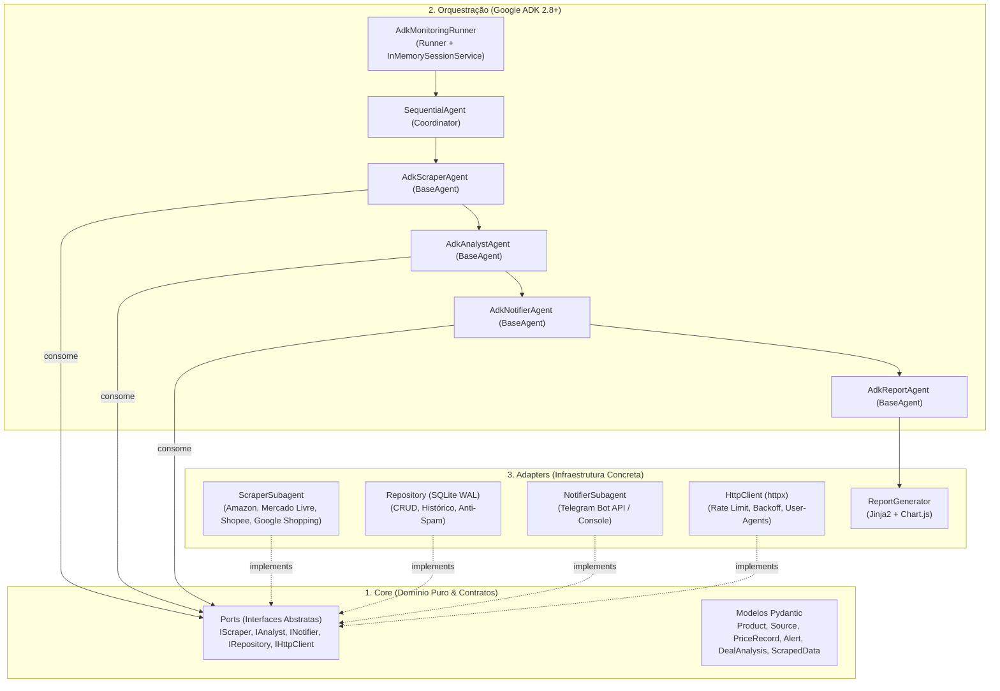
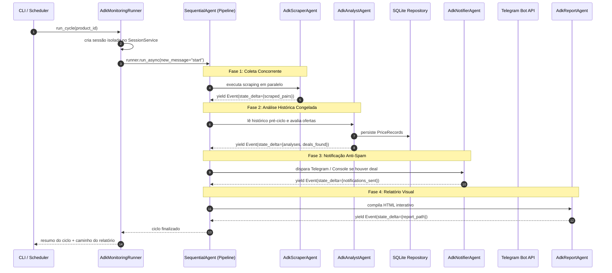

# PromoRadar 🛰️


Agente autônomo e modular para monitoramento contínuo de preços de produtos na web, detecção de promoções reais com base em histórico persistido, relatórios visuais interativos e alertas automáticos via Telegram.

Construído sobre o **Google Agent Development Kit (ADK 2.8+)** e seguindo os princípios da **Arquitetura Hexagonal (Ports & Adapters)**, o PromoRadar automatiza a varredura concorrente em múltiplos e-commerces, isola falhas por marketplace, previne promoções maquiadas ("metade do dobro") e emite notificações acionáveis no momento exato em que o produto atinge o alvo estipulado.

---

## 📑 Sumário

- [Funcionalidades Principais](#-funcionalidades-principais)
- [Arquitetura Hexagonal & Google ADK](#-arquitetura-hexagonal--google-adk)
- [Stack Tecnológica](#-stack-tecnológica)
- [Pré-requisitos](#-pré-requisitos)
- [Instalação](#-instalação)
- [Configuração](#-configuração)
- [Como Usar](#-como-usar)
- [Relatórios Visuais HTML](#-relatórios-visuais-html)
- [Exemplo de Notificação](#-exemplo-de-notificação)
- [Estrutura de Pastas](#-estrutura-de-pastas)
- [Como Adicionar um Novo Marketplace](#-como-adicionar-um-novo-marketplace)
- [Solução de Problemas (Troubleshooting)](#-solução-de-problemas-troubleshooting)
- [Roadmap](#-roadmap)
- [Aviso Legal](#-aviso-legal)
- [Licença](#-licença)
- [Como Contribuir](#-como-contribuir)

---

## ✨ Funcionalidades Principais

- **Orquestração Multiagente via Google ADK:** Pipeline determinístico composto por agentes especialistas (`BaseAgent`) orquestrados via `SequentialAgent` e gerenciados por `AdkMonitoringRunner`.
- **Arquitetura Hexagonal (Ports & Adapters):** Domínio de negócio e modelos desacoplados de infraestrutura através de portas abstratas (`IScraper`, `IAnalyst`, `INotifier`, `IRepository`, `IHttpClient`).
- **Monitoramento Concorrente com Isolamento de Falhas:** Coleta assíncrona paralela via `asyncio.gather(..., return_exceptions=True)`. A queda de uma loja nunca afeta as demais.
- **Detecção Rigorosa de Falsos Descontos:** Heurística que confronta o preço original anunciado contra a média histórica de 60 dias e contra o teto máximo do usuário, desmascarando a "metade do dobro" mesmo no 1º dia de monitoramento.
- **Linha de Base Histórica Congelada:** Fotografia pré-ciclo estável que impede que a cotação gravada por um marketplace contamine o cálculo de "menor preço histórico" das fontes subsequentes no mesmo ciclo.
- **Relatórios Visuais HTML Interativos:** Geração automática de páginas HTML responsivas (tema dark) com gráficos comparativos e evolução temporal usando Chart.js e Jinja2.
- **Alertas Ricos via Telegram com Anti-Spam:** Notificações instantâneas com badge de oportunidade, justificativa e link direto, com supressão inteligente para evitar repetição em menos de 6 horas.
- **Persistência Confiável em SQLite:** Banco de dados local com modo WAL (Write-Ahead Logging) ativo para leitura e escrita concorrente veloz.

---

## 🏛️ Arquitetura Hexagonal & Google ADK

O PromoRadar separa estritamente regras de negócio de tecnologias externas:

### Diagrama de Componentes (Ports & Adapters)



### Fluxo de Execução do Ciclo ADK



---

## 🧰 Stack Tecnológica

| Camada | Tecnologia | Justificativa / Uso |
|---|---|---|
| **Linguagem** | Python 3.10+ (testado em 3.14) | Tipagem moderna, ecossistema assíncrono de alto desempenho |
| **Framework de Agentes** | Google ADK (`google-adk` 2.8+) | Orquestração nativa, agentes determinísticos (`BaseAgent`), propagação de estado por eventos |
| **Arquitetura** | Hexagonal (Ports & Adapters) | Total desacoplamento entre domínio, persistência, scraping e notificação |
| **Scraping Estático** | `httpx` + `BeautifulSoup4` | Requisições assíncronas com backoff, rate limit por domínio e rotação de headers |
| **Validação de Dados** | `pydantic` v2 + `pydantic-settings` | Schemas estritos de domínio e tipagem das configurações de ambiente |
| **Banco de Dados** | SQLite (modo WAL) | Persistência local rápida, sem necessidade de subir serviços de terceiros no MVP |
| **Relatórios Visuais** | `jinja2` + Chart.js | Relatórios HTML responsivos com gráficos comparativos e temporais |
| **Agendamento** | `APScheduler` | Daemon assíncrono para execução periódica com suporte a modo simulação |
| **Notificações** | Telegram Bot API | Disparo push imediato via HTTP com formatação rica em HTML e fallback para console |
| **Logs & Testes** | `loguru`, `pytest`, `pytest-asyncio` | Logs coloridos/estruturados e 26 testes automatizados com fixtures offline |
| **Qualidade de Código** | `ruff` | Linter e formatador de alto desempenho |

---

## ⚙️ Pré-requisitos

- **Python:** Versão 3.10 ou superior (totalmente compatível com Python 3.14).
- **Git:** Para clonagem e versionamento.
- **Credenciais do Telegram (Opcional):** Token do bot (`TELEGRAM_BOT_TOKEN`) e ID do chat (`TELEGRAM_CHAT_ID`). Se não preenchidos, os alertas são exibidos com destaque no terminal.

---

## 📦 Instalação

```bash
# 1. Clonar o repositório
git clone https://github.com/hlaff147/price-scout-agent.git
cd price-scout-agent

# 2. Criar e ativar o ambiente virtual (.venv)
python3 -m venv .venv
source .venv/bin/activate

# 3. Instalar dependências em modo editável com ferramentas de desenvolvimento
pip install -e ".[dev]"

# 4. Configurar as variáveis de ambiente
cp .env.example .env
```

Edite o arquivo `.env` para personalizar suas credenciais:

```env
TELEGRAM_BOT_TOKEN=seu_token_aqui
TELEGRAM_CHAT_ID=seu_chat_id_aqui
DATABASE_PATH=data/promoradar.db
LOG_LEVEL=INFO
CHECK_INTERVAL_HOURS=1
DRY_RUN=false
```

---

## 🛠️ Configuração

Os produtos monitorados ficam declarados no arquivo [`src/config/products.yaml`](file:///Users/humbertolimadealcantarafonsecafilho/price-scout-agent/src/config/products.yaml):

```yaml
products:
  - id: "huawei-freebuds-pro-5"
    nome: "Huawei FreeBuds Pro 5"
    keywords:
      - "Huawei FreeBuds Pro 5"
      - "FreeBuds Pro 5"
      - "Huawei FreeBuds Pro"
    preco_alvo: 850.00
    preco_maximo: 1100.00
    ativo: true
    sources:
      - marketplace: "amazon"
        url_produto: "https://www.amazon.com.br/s?k=Huawei+FreeBuds+Pro+5"
        metodo_coleta: "scraping_html"
        ativo: true

      - marketplace: "mercadolivre"
        url_produto: "https://lista.mercadolivre.com.br/huawei-freebuds-pro-5"
        metodo_coleta: "scraping_html"
        ativo: true

      - marketplace: "shopee"
        url_produto: "https://shopee.com.br/search?keyword=Huawei%20FreeBuds%20Pro%205"
        metodo_coleta: "scraping_html"
        ativo: true

      - marketplace: "google_shopping"
        url_produto: "https://www.google.com/search?q=huawei+Freebuds+Pro+5&udm=28"
        metodo_coleta: "scraping_html"
        ativo: true

      # Fontes desativadas onde não compensa buscar:
      - marketplace: "kabum"
        url_produto: "https://www.kabum.com.br/busca/huawei-freebuds-pro-5"
        ativo: false
        motivo_desativacao: "preco_muito_caro"

      - marketplace: "aliexpress"
        url_produto: "https://pt.aliexpress.com/w/wholesale-huawei-freebuds-pro-5.html"
        ativo: false
        motivo_desativacao: "imposto_importacao_elevado"
```

---

## 🚀 Como Usar

### 1. Execução Sob Demanda (Ciclo Único via Google ADK)

```bash
# Execução padrão (Google ADK + gera relatório HTML + abre no navegador):
python scripts/run_cycle.py

# Filtrando por um produto específico:
python scripts/run_cycle.py --product huawei-freebuds-pro-5

# Simulação sem envio de alertas reais (Dry-Run):
python scripts/run_cycle.py --dry-run

# Gera o relatório HTML mas não abre automaticamente no navegador:
python scripts/run_cycle.py --no-open

# Desabilita a geração do relatório HTML:
python scripts/run_cycle.py --no-report

# Fallback opcional para o orquestrador procedural anterior:
python scripts/run_cycle.py --legacy
```

### 2. Execução Agendada Contínua (Daemon)

```bash
# Inicia o daemon periódico (intervalo padrão configurado no .env):
python scripts/schedule_daemon.py

# Definindo intervalo customizado (ex: a cada 2 horas):
python scripts/schedule_daemon.py --interval-hours 2

# Modo simulação agendado (sem disparo real):
python scripts/schedule_daemon.py --dry-run
```

### 3. Atalhos via Makefile

```bash
make run       # Executa o ciclo sob demanda com Google ADK
make dry-run   # Executa em modo simulação com logs verbose
make test      # Executa a suíte completa de 26 testes automatizados
make daemon    # Inicia o daemon agendado
```

---

## 📊 Relatórios Visuais HTML

Ao final de cada ciclo, o PromoRadar compila automaticamente um relatório visual em `reports/`:
- **Tema Dark Moderno:** Layout responsivo otimizado para desktop e mobile.
- **Gráfico Comparativo de Preços:** Barras por marketplace com linhas de referência horizontais para o Preço Alvo e o Preço Máximo.
- **Gráfico de Tendência Histórica:** Curvas temporais demonstrando a variação de preços ao longo das semanas por loja.
- **Cards de Status e Oportunidades:** Indicadores de fontes consultadas, cotações válidas, ofertas ativas e erros isolados.

Para inspecionar relatórios gerados manualmente:
```bash
open reports/huawei-freebuds-pro-5_*.html
```

---

## 📬 Exemplo de Notificação

Quando uma oportunidade é identificada, o alerta chega formatado no Telegram:

```text
🎯 PREÇO ABAIXO DO ALVO DEFINIDO!

📦 Produto: Huawei FreeBuds Pro 5
🛒 Loja: AMAZON
💰 Preço Atual: R$ 721,64
📉 Mínima Anterior: R$ 899,00
🏷️ Desconto Real: 19.7% (vs. histórico)
🎟️ Cupom Disponível: PROMOFONE

💡 Preço de R$ 721,64 atingiu seu alvo de compra (R$ 850,00).

🔗 Ver Oferta na Loja (https://www.amazon.com.br/dp/B0...)
```

---

## 📂 Estrutura de Pastas

```
promo-radar/
├── src/
│   ├── core/                # 🔵 Núcleo da Arquitetura Hexagonal
│   │   └── ports/           # Interfaces abstratas (IScraper, IAnalyst, INotifier, IRepository, IHttpClient)
│   ├── agents/              # 🟡 Agentes Google ADK (BaseAgent, SequentialAgent, AdkRunner)
│   │   ├── scraper_agent.py
│   │   ├── analyst_agent.py
│   │   ├── notifier_agent.py
│   │   ├── report_agent.py
│   │   ├── coordinator.py
│   │   └── adk_runner.py
│   ├── orchestrator/        # Orquestrador procedural (mantido para fallback --legacy)
│   ├── subagents/           # 🟢 Adaptadores especialistas (Scraper, Analista, Notificador)
│   ├── skills/              # Parsers de marketplaces e detecção de falsos descontos
│   │   ├── parse_amazon/
│   │   ├── parse_mercadolivre/
│   │   ├── parse_shopee/
│   │   ├── parse_google_shopping/
│   │   ├── parse_aliexpress/
│   │   ├── parse_kabum/
│   │   ├── normalize_product/
│   │   ├── detect_fake_discount/
│   │   └── format_alert/
│   ├── tools/               # 🔧 ADK Tools e HttpClient resiliente
│   ├── reporting/           # 📊 Gerador de relatórios HTML (Jinja2 + Chart.js)
│   │   └── templates/       # Template HTML responsivo
│   ├── data/                # Models Pydantic e persistência SQLite WAL
│   └── config/              # Produtos (YAML) e configurações (.env)
├── tests/                   # 🧪 26 testes unitários e de integração
│   ├── fixtures/            # HTMLs offline reais para testes sem rede
│   ├── test_ports.py        # Validação de conformidade com os Ports
│   ├── test_adk_agents.py   # Testes do pipeline e runners do Google ADK
│   ├── test_parsers.py      # Testes dos parsers de cada marketplace
│   ├── test_analyst.py      # Testes de histórico estável e falso desconto
│   ├── test_repository.py   # CRUD, histórico e anti-spam no SQLite
│   └── test_orchestrator.py # Testes de isolamento de falhas
├── scripts/                 # CLI sob demanda e daemon de agendamento
├── docs/                    # NEGOCIAL.md, TECNICO.md e ARQUITETURA.md (com ADRs)
├── reports/                 # Relatórios HTML gerados pós-ciclo (ignorado no git)
├── .env.example
├── pyproject.toml
├── Makefile
├── LICENSE                  # Licença MIT
└── README.md
```

---

## 🔌 Como Adicionar um Novo Marketplace

O design modular permite estender fontes sem alterar as regras de negócio:

1. **Crie a Skill:** Adicione a pasta `src/skills/parse_<marketplace>/` com `SKILL.md` e `parser.py` (herdando de `BaseSkill`).
2. **Registre a Skill:** No dicionário `SKILL_REGISTRY` em [`src/subagents/scraper_agent/agent.py`](file:///Users/humbertolimadealcantarafonsecafilho/price-scout-agent/src/subagents/scraper_agent/agent.py).
3. **Configure o Produto:** Adicione o novo marketplace na seção `sources` em [`src/config/products.yaml`](file:///Users/humbertolimadealcantarafonsecafilho/price-scout-agent/src/config/products.yaml).
4. **Adicione Testes:** Salve um HTML de exemplo em `tests/fixtures/` e adicione o teste unitário em `tests/test_parsers.py`.

---

## 🔧 Solução de Problemas (Troubleshooting)

| Sintoma | Causa Mais Provável | Solução Recomendada |
|---|---|---|
| `Sem resultado: 3` no console | Páginas que renderizam produtos exclusivamente via JavaScript no cliente | O PromoRadar utiliza requisições estáticas HTTP velozes no MVP. Caso a loja mude layout para JS estrito, o resultado é classificado como "sem resultado" sem quebrar o ciclo. Para a versão 2.0, o suporte a Playwright cobrirá essas fontes. |
| `Telegram não configurado...` | Ausência de `TELEGRAM_BOT_TOKEN` no arquivo `.env` | O PromoRadar continua funcionando normalmente exibindo alertas no terminal. Para habilitar Telegram, crie um bot no `@BotFather` e preencha as chaves no `.env`. |
| Erro de lock no SQLite | Múltiplos processos acessando o arquivo sem modo WAL | O banco é inicializado automaticamente com `PRAGMA journal_mode = WAL`. Certifique-se de que o diretório `data/` tenha permissão de escrita para o usuário local. |
| `command not found: python` | Execução fora do ambiente virtual ativo | Execute sempre ativando o `.venv` (`source .venv/bin/activate`) ou use o `make run` / `python3 scripts/run_cycle.py`. |

---

## 🗺️ Roadmap

Evoluções planejadas para versões futuras:

1. [x] MVP funcional com monitoramento multi-marketplace e histórico persistido.
2. [x] Arquitetura Hexagonal (Ports & Adapters) e orquestração com Google ADK 2.8+.
3. [x] Relatórios visuais pós-ciclo em HTML com gráficos interativos Chart.js.
4. [ ] Múltiplos produtos simultâneos com diferentes níveis de prioridade.
5. [ ] Suporte a automação de navegador via Playwright para marketplaces JS-pesados.
6. [ ] Subagentes inteligentes com Gemini (self-healing scraper para reparo automático de seletores CSS).
7. [ ] Deduplicação semântica de variantes (cor/edição global) e bot conversacional no Telegram.
8. [ ] Alertas especializados por cupom e código promocional.
9. [ ] Empacotamento Docker e deploy de serviço agendado em nuvem.

---

## ⚖️ Aviso Legal

Este projeto foi desenvolvido para fins de pesquisa, automação pessoal e estudo de engenharia de software orientada a agentes.
- Os scrapers devem ser utilizados com responsabilidade, respeitando o arquivo `robots.txt` e os limites razoáveis de requisição de cada portal.
- Não realizamos coleta de dados de caráter pessoal de terceiros.
- Sempre que disponível, priorize o uso de APIs oficiais e integrações diretas com os lojistas.

---

## 📄 Licença

Distribuído sob a licença **MIT**. Consulte o arquivo [`LICENSE`](file:///Users/humbertolimadealcantarafonsecafilho/price-scout-agent/LICENSE) para mais informações.

---

## 🤝 Como Contribuir

1. Faça um Fork do projeto.
2. Crie uma branch para sua funcionalidade (`git checkout -b feature/novo-marketplace`).
3. Garanta que a suíte de 26 testes passe (`pytest -v tests/`).
4. Envie o commit com mensagens claras (`git commit -m 'feat: adiciona skill do marketplace X'`).
5. Abra um Pull Request detalhando as alterações.
