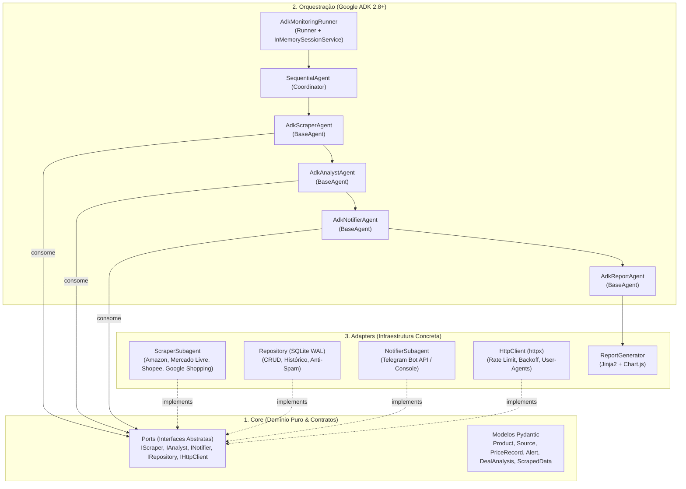
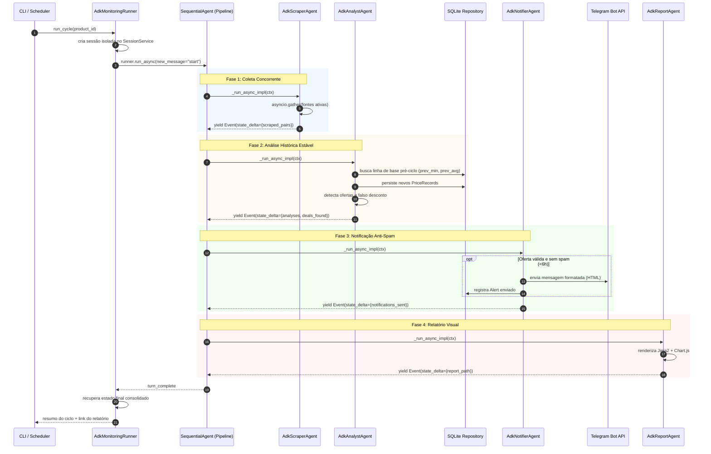

# Documento de Arquitetura — PromoRadar

## 1. Visão Geral

O **PromoRadar** adota uma arquitetura híbrida moderna que combina **Arquitetura Hexagonal (Ports & Adapters)** com o **Google Agent Development Kit (ADK 2.8+)**. 

O sistema é estruturado em três macro-camadas:
1. **Core (Domínio Puro):** Regras de negócio, modelos de dados Pydantic e interfaces abstratas (Ports) completamente livres de frameworks externos.
2. **Camada de Agentes (Google ADK):** Agentes determinísticos (`BaseAgent`) orquestrados sequencialmente em um pipeline (`SequentialAgent`), gerenciando estado compartilhado da sessão com rastreabilidade total.
3. **Adapters (Infraestrutura):** Implementações concretas para scraping de marketplaces, cliente HTTP com backoff, persistência em SQLite, envio de alertas via Telegram e geração de relatórios visuais em HTML.

---

## 2. Camadas da Arquitetura Hexagonal

| Camada | Módulo / Pacote | Responsabilidade |
|---|---|---|
| **Core (Domínio & Ports)** | `src/core/ports/`, `src/data/models.py` | Define as interfaces abstratas (`IScraper`, `IAnalyst`, `INotifier`, `IRepository`, `IHttpClient`) e os schemas de dados. Zero acoplamento com redes, bancos ou frameworks. |
| **Agentes ADK** | `src/agents/` | Agentes orientados a eventos (`google.adk.agents.BaseAgent`). Orquestram a execução dos casos de uso, recebem o estado da sessão e propagam dados via `EventActions(state_delta={...})`. |
| **Adapters de Coleta** | `src/subagents/scraper_agent/`, `src/skills/` | Implementa `IScraper`. Contém os parsers de HTML específicos por marketplace e estratégias de extração. |
| **Adapters de Análise** | `src/subagents/price_analyst_agent/` | Implementa `IAnalyst`. Avalia desconto real contra histórico de 60 dias e detecta maquiagem de preços ("metade do dobro"). |
| **Adapters de Alerta** | `src/subagents/notifier_agent/`, `src/tools/notification_tools.py` | Implementa `INotifier`. Dispara mensagens formatadas no Telegram com controle de anti-spam (supressão em < 6h). |
| **Adapters de Persistência** | `src/data/repository.py`, `src/data/database.py` | Implementa `IRepository`. Persiste cotações e alertas em SQLite no modo WAL (Write-Ahead Logging). |
| **Adapters de Relatório** | `src/reporting/report_generator.py` | Renderiza relatórios HTML visuais e responsivos com gráficos comparativos e históricos via Chart.js. |
| **Execução & CLI** | `scripts/run_cycle.py`, `scripts/schedule_daemon.py` | Ponto de entrada para execução sob demanda ou em segundo plano via `APScheduler`. |

---

## 3. Orquestração via Google ADK

O pipeline do PromoRadar utiliza o **Google ADK** de forma determinística (agentes não-LLM, custo zero de tokens e latência em milissegundos), deixando a arquitetura pronta para futura injeção de agentes com LLM (ex.: self-healing scrapers):

1. **`AdkMonitoringRunner`**: Inicializa a sessão com `InMemorySessionService`, configura o estado inicial (`product`, `sources`, `dry_run`, `generate_report`) e inicia o streaming do `Runner`.
2. **`AdkScraperAgent`**:
   - Lê fontes ativas da sessão.
   - Dispara scraping concorrente com `asyncio.gather(..., return_exceptions=True)`.
   - Classifica resultados entre cotações coletadas, "sem resultado" e erros de rede.
   - Emite evento com `EventActions(state_delta={"scraped_pairs": ...})`.
3. **`AdkAnalystAgent`**:
   - Congela a linha de base histórica pré-ciclo (`prev_min`, `prev_avg`).
   - Avalia ofertas sem contaminação entre fontes do mesmo ciclo.
   - Emite evento com `EventActions(state_delta={"analyses": ..., "deals_found": ...})`.
4. **`AdkNotifierAgent`**:
   - Processa as ofertas detectadas e aplica a política anti-spam.
   - Dispara alertas no Telegram ou exibe no Console.
   - Emite evento com `EventActions(state_delta={"notifications_sent": ...})`.
5. **`AdkReportAgent`**:
   - Constrói o resumo do ciclo e compila o relatório HTML interativo com Chart.js.
   - Emite evento com `EventActions(state_delta={"report_path": ...})`.

---

## 4. Fluxo de Execução (Ciclo Completo)

---

## 5. Skills e ADK Tools

### Skills (Módulos de Domínio & Extração)
Skills funcionam como procedimentos desacoplados reutilizáveis:
- **`parse_<marketplace>`**: Extrai preço, título e disponibilidade usando seletores CSS resilientes.
- **`normalize_product`**: Padroniza caracteres, moedas (`R$ 1.234,56`) e valida relevância por palavras-chave.
- **`detect_fake_discount`**: Heurística de confronto contra histórico real e contra teto máximo do usuário.
- **`format_alert`**: Formata mensagens em HTML para o Telegram e texto estruturado para console.

### ADK Tools (Funções Python Puras)
Localizadas em `src/tools/`:
- **`scraping_tools.py`**: `fetch_page_content(url)`, `parse_marketplace_html(html, marketplace, url)`.
- **`analysis_tools.py`**: `evaluate_fake_discount(...)`, `query_historical_prices(...)` (com injeção de `IRepository`).
- **`notification_tools.py`**: `send_telegram_notification(text, parse_mode)`.

---

## 6. Registro de Decisões de Arquitetura (ADRs)

| ADR | Título | Status | Decisão & Justificativa |
|---|---|---|---|
| **ADR-001** | Adoção do Google Agent Development Kit (ADK) | **Aprovada** | Substituiu o plano inicial de orquestrador puramente procedural e ideias de Claude SDK por `google-adk` (2.8+). Permite pipeline multiagente tipado, suporte nativo a agentes determinísticos (`BaseAgent`), propagação de estado padronizada (`EventActions`) e facilidade de plugar agentes com Gemini no futuro sem alterar o pipeline. |
| **ADR-002** | Refatoração para Arquitetura Hexagonal (Ports & Adapters) | **Aprovada** | Criação de interfaces abstratas (`IScraper`, `IAnalyst`, `INotifier`, `IRepository`, `IProductManagementPort`, `ISelectorRepositoryPort`, `ICouponRepositoryPort`, `IHttpClient`) em `src/core/ports/`. Garante que os agentes e a lógica de negócio não conheçam detalhes de rede, browser, banco ou Telegram, viabilizando mocks e troca de tecnologia com impacto zero no core. |
| **ADR-003** | Relatórios Visuais HTML pós-ciclo com Chart.js | **Aprovada** | Em vez de depender de um servidor de dashboard pesado (Streamlit) ativo 24/7, o próprio ciclo compila um arquivo HTML estático autocontido com gráficos interativos de histórico e comparação de preços, abrindo automaticamente no navegador. |
| **ADR-004** | Scraping HTTP Direto vs. Servidores MCP no MVP | **Aprovada** | Servidores MCP externos (Playwright, Search) adicionam custo de processo desnecessário para páginas onde requests estáticos com rotação de User-Agents atendem perfeitamente. O MCP permanece reservado para expansão futura. |
| **ADR-005** | Isolamento da Linha de Base no Analista de Preços | **Aprovada** | A consulta de mínima e média histórica (`prev_min`, `prev_avg`) deve ser capturada uma única vez no início do lote do produto, impedindo que a gravação de uma fonte contamine a comparação das fontes subsequentes no mesmo ciclo. |
| **ADR-006** | Priorização Diferenciada de Produtos e Rate Limiting por Domínio | **Aprovada** | Implementado escalonamento por prioridade (`HIGH`=1h, `MEDIUM`=4h, `LOW`=12h) com atualização atômica de `proximo_ciclo_em`. `DomainRateLimiter` thread-safe com semáforos e timestamps independentes por domínio garante espaçamento de 1.5s–3.0s, impedindo que requisições paralelas gerem bloqueios por taxa. |
| **ADR-007** | Suporte Híbrido a Playwright com Browser Pool e Fallback Dinâmico | **Aprovada** | Para marketplaces JS-pesados (SPAs), implementado `PlaywrightBrowserPool` reutilizando contextos de browser e bloqueando requisições não essenciais (imagens, fontes, mídia). `ScraperSubagent` orquestra dinamicamente chamadas HTTP estáticas com fallback automático para Playwright quando o HTML for uma casca vazia. |
| **ADR-008** | Deduplicação Semântica de Variantes e Driving Adapter Telegram Bot | **Aprovada** | Implementado `HybridProductMatcher` rejeitando rigorosamente anúncios de capinhas/acessórios, discrepâncias de capacidade de memória e divergências de edições (Global vs. Nacional). O `TelegramBotService` foi adicionado como driving adapter com controle de autorização via whitelist para comandos de controle `/list`, `/add`, `/priority`, `/pause`, `/resume`, `/coupons`, `/check` e `/status`. |
| **ADR-009** | Subagente Self-Healing com Gemini, Sanitização de DOM e Validação Sandbox | **Aprovada** | Quando um scraper de marketplace quebra, `GeminiHealerSubagent` propõe novos seletores CSS usando Gemini 1.5 Flash sobre um HTML sanitizado (redução de 85% de tokens). Novos seletores nunca são ativados sem aprovação prévia em ambiente sandbox isolado (validação de palavras-chave e plausibilidade de preço). Protegido por circuit breaker com teto de 2 tentativas por dia por loja. |
| **ADR-010** | Detecção, Persistência e Alertas Especializados por Cupom | **Aprovada** | Criada a entidade `Coupon`, tabela SQLite `coupons` e interface `ICouponRepositoryPort`. `ParseCouponSkill` extrai códigos e descontos; `PriceAnalystSubagent` calcula o preço efetivo real pós-desconto; e `NotifierSubagent.notify_coupon` emite alertas com layout visual específico para cupons. |

