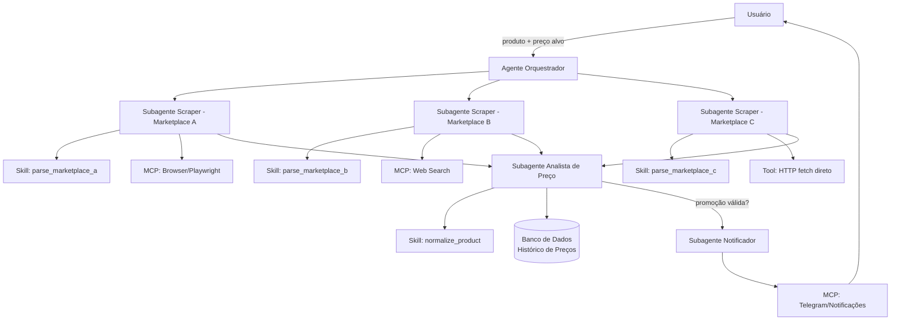
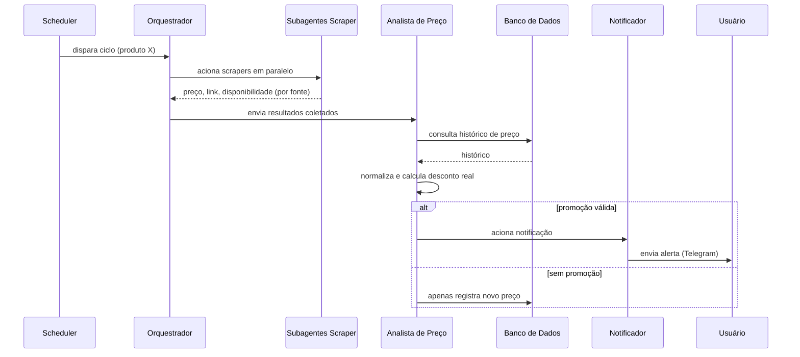

# Documento de Arquitetura — PromoRadar

## 1. Visão Geral

Arquitetura orientada a agentes: um **agente orquestrador** recebe o produto
de interesse e coordena **subagentes** especializados, que usam **skills**
(instruções + lógica reutilizável) e **MCP servers**/**tools** para executar
o trabalho de coleta, análise e notificação.

## 2. Camadas da Arquitetura

| Camada | Responsabilidade |
|---|---|
| Interface | Entrada do usuário (config de produto, CLI, ou chat) |
| Orquestração | Agente principal: decide quais subagentes acionar e quando |
| Subagentes | Unidades especializadas com escopo restrito de tarefa |
| Skills | Conhecimento/procedimento reutilizável (ex.: como extrair preço de um site específico) |
| MCP / Tools | Capacidades externas concretas (navegador, busca, notificação, DB) |
| Dados | Persistência de produtos, fontes, preços e alertas |
| Agendamento | Dispara o ciclo de monitoramento periodicamente |

## 3. Agente Orquestrador

**Responsabilidade:** receber o produto monitorado, decidir quais fontes
consultar, disparar os subagentes de scraping em paralelo, aguardar os
resultados, encaminhar ao subagente analista e decidir se aciona o
notificador.

**Entrada:** `Product` (nome, keywords, preço alvo/máximo).
**Saída:** log do ciclo + (opcionalmente) alerta disparado.

## 4. Subagentes

### 4.1 Subagente Scraper (um por marketplace ou grupo de marketplaces)
- **Responsabilidade:** dado um produto, buscar/raspar a página de resultado
  ou de produto e devolver preço, disponibilidade, link e cupom (se houver).
- **Isolamento:** falha em um scraper não deve derrubar os demais — o
  orquestrador trata cada subagente como unidade independente com tratamento
  de erro próprio.
- **Usa:** skill de parsing específica do site + MCP de browser (se o site
  depende de JavaScript) ou tool de HTTP direto (se HTML estático).

### 4.2 Subagente Analista de Preço
- **Responsabilidade:** normalizar os resultados recebidos (mesma unidade,
  mesma variante do produto), consultar o histórico no banco, calcular
  desconto real (vs. preço histórico, não vs. preço "riscado" do site) e
  decidir se a oferta atende ao critério do usuário.
- **Usa:** skill `normalize_product`, acesso direto ao banco de dados.

### 4.3 Subagente Notificador
- **Responsabilidade:** formatar e enviar a notificação pelo canal
  configurado, incluir link direto, preço, desconto e justificativa
  (ex.: "menor preço dos últimos 60 dias").
- **Usa:** MCP de notificação (Telegram/Discord/e-mail).

## 5. Skills

Skills funcionam como "manuais de procedimento" reutilizáveis que os
subagentes consultam antes de agir — evita reimplementar lógica em cada
subagente e facilita adicionar um novo marketplace sem tocar no orquestrador.

| Skill | Usada por | Função |
|---|---|---|
| `parse_<marketplace>` | Subagente Scraper | Regras de extração de preço/título/disponibilidade daquele site específico |
| `normalize_product` | Subagente Analista | Padronizar nome/variante do produto entre fontes diferentes |
| `format_alert` | Subagente Notificador | Template de mensagem de alerta |
| `detect_fake_discount` | Subagente Analista | Heurística para identificar "preço riscado" inflado artificialmente |

Cada skill segue o padrão de pasta com `SKILL.md` (instruções) + código de
apoio, permitindo evoluir/testar cada uma isoladamente.

## 6. MCP Servers

MCP é usado para capacidades que fazem sentido como serviço externo
reutilizável entre vários subagentes:

| MCP Server | Propósito |
|---|---|
| Browser (Playwright) | Renderizar páginas com JavaScript pesado / anti-bot básico |
| Web Search | Encontrar página do produto quando a URL direta não é conhecida |
| Notificações (Telegram) | Envio de mensagens ao usuário |
| Banco de Dados (opcional) | Persistência via MCP em vez de acesso direto, se quiser desacoplar |

> Observação: nem toda capacidade precisa ser um MCP — scraping HTML simples
> via `requests`/`BeautifulSoup` pode ser uma **tool** comum, mais barata e
> rápida que subir um MCP server só para isso. MCP compensa quando a
> capacidade é reutilizada por múltiplos agentes/projetos ou exige estado
> (ex.: sessão de navegador).

## 7. Tools (funções diretas do agente)

| Tool | Função |
|---|---|
| `fetch_html(url)` | Requisição HTTP simples com headers/retry |
| `extract_price(html, skill)` | Aplica a skill de parsing correspondente |
| `save_price_record(...)` | Persiste no banco |
| `get_price_history(product_id)` | Consulta histórico para comparação |
| `check_threshold(preco, alvo, historico)` | Decide se é uma promoção válida |

## 8. Fluxo de Execução (ciclo de monitoramento)

## 9. Modelo de Extensibilidade

Para adicionar um novo marketplace:
1. Criar uma nova skill `parse_<novo_marketplace>` com as regras de extração.
2. Criar/configurar um novo Subagente Scraper apontando para essa skill.
3. Registrar o marketplace na config do produto (`Source`).
4. Nenhuma mudança é necessária no orquestrador ou no analista — eles
   trabalham com o formato normalizado de saída, independente da fonte.

## 10. Decisões de Arquitetura (resumo)

| Decisão | Alternativa considerada | Motivo da escolha |
|---|---|---|
| Subagentes por marketplace (não 1 agente genérico) | Um único scraper genérico | Isolamento de falha e facilidade de manter regras específicas por site |
| SQLite no MVP | Postgres desde o início | Menor fricção para começar; migração é trivial depois |
| MCP só onde há reuso/estado | MCP para tudo | Reduz complexidade operacional no MVP |
| Análise de "desconto real" via histórico | Confiar no rótulo do site | Evita cair em falsas promoções |
